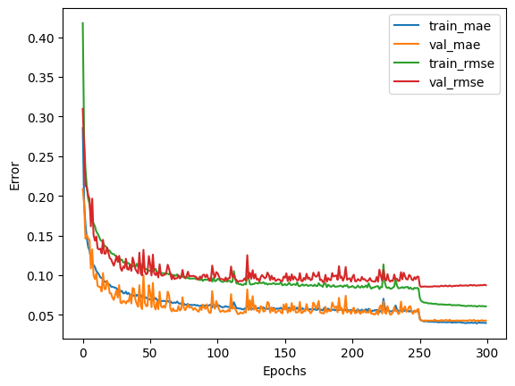
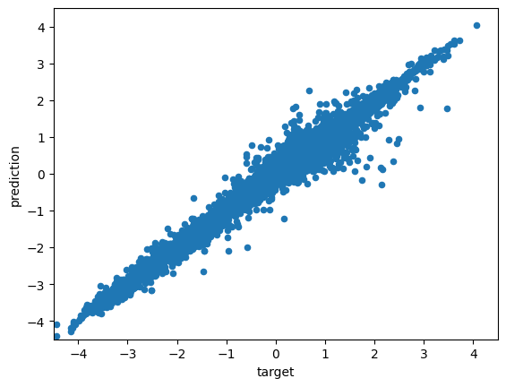

# Training a CGNN model on Colab

* log.txt
* history.csv
* test_predictions.csv
* model.pth

| Model      | RMSE (meV) | MAE (meV)  | Time   |
|------------|-----------:|-----------:|-------:|
| Benchmark  |       87.7 |       42.8 | 2h 10m |
| Database   |      124.2 |       84.8 |     NA |

  
  

