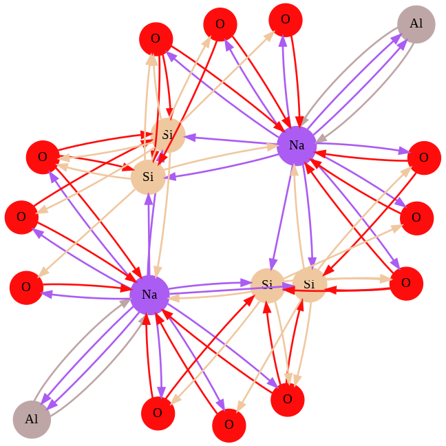
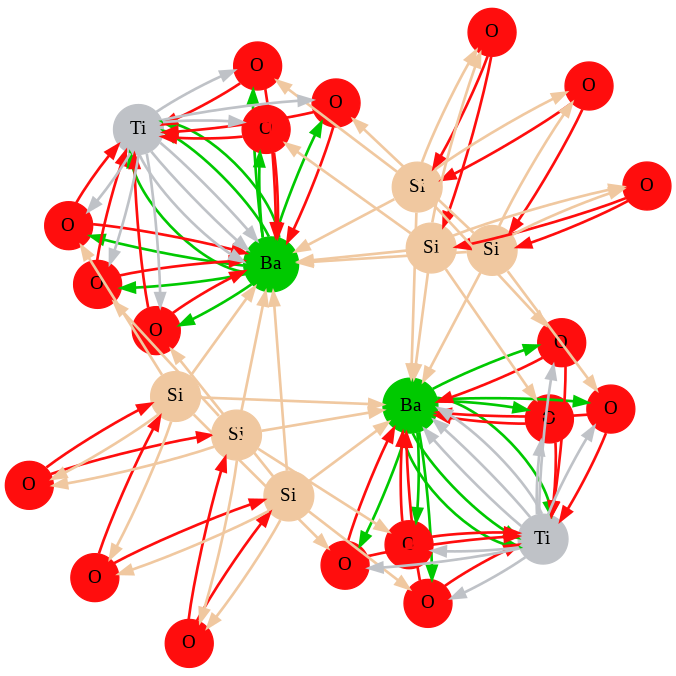
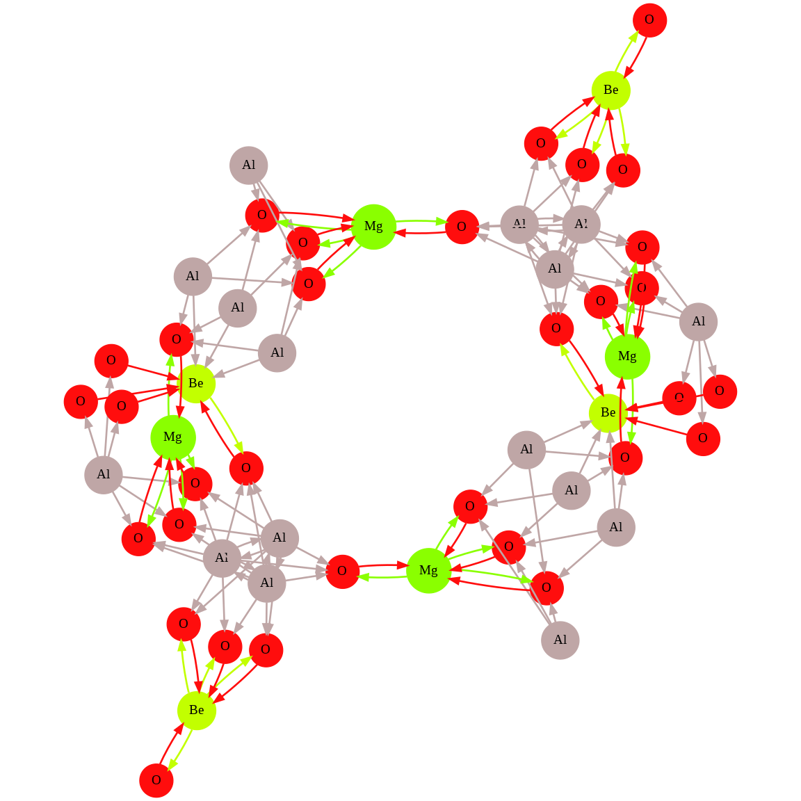
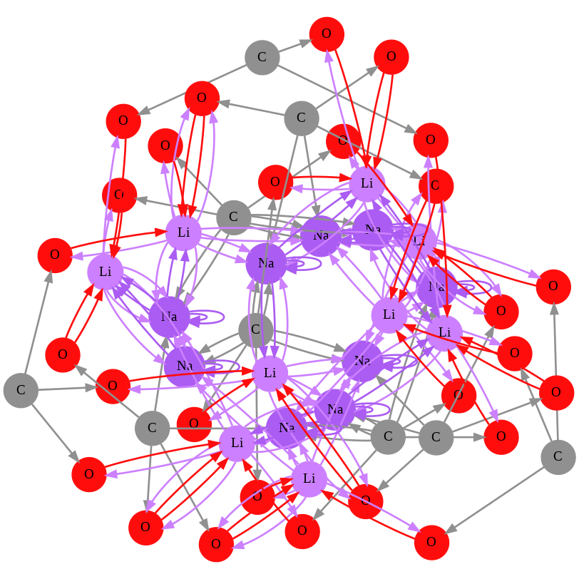
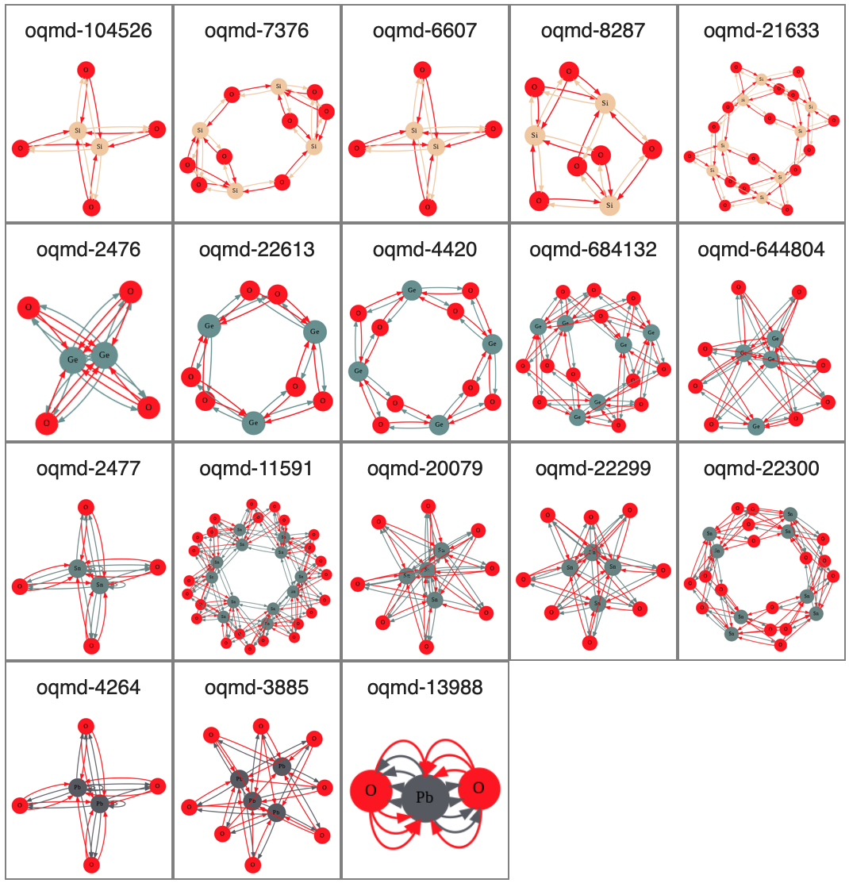
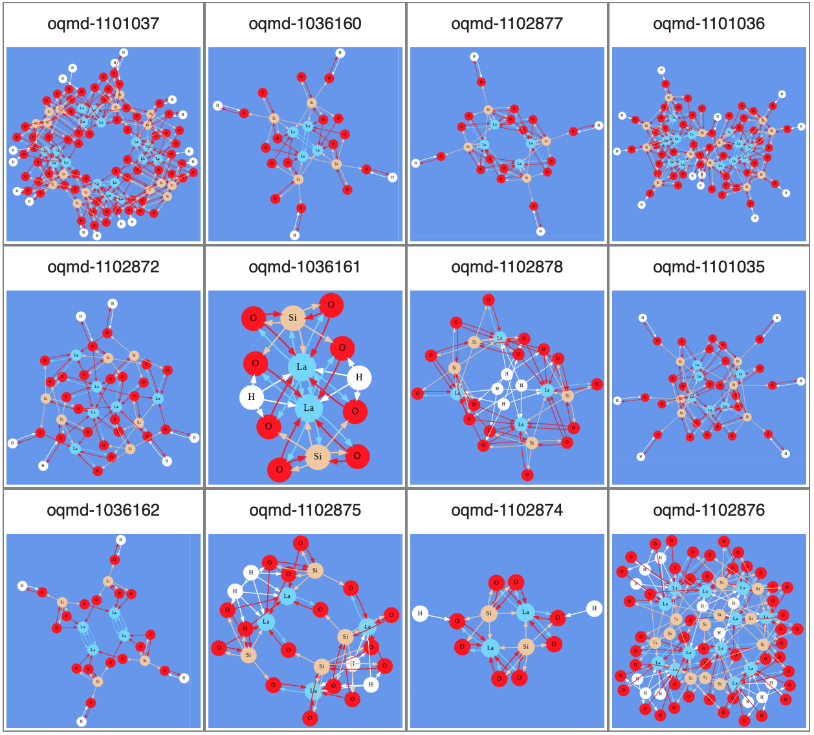

[](https://colab.research.google.com/github/Tony-Y/oqmd-v1.2-dataset-for-cgnn/blob/main/OQMD_v1_2_dataset_for_CGNN.ipynb)

# OQMD v1.2 Dataset for CGNN
This dataset is downloadable from [this link](https://doi.org/10.5281/zenodo.7118055), which contains 561,888 materials. Its format is described in [here](https://github.com/Tony-Y/cgnn#dataset-files). The original data is available at [the OQMD website](https://oqmd.org/).

Click on the above Colab link to create a Colab notebook for a data loading tutorial.

How to create this dataset is described in [here](https://github.com/Tony-Y/cgnn/tree/master/OQMD).

## Abnormal Entry
There is an obviously abnormal entry in this dataset.

| index  | name        | formula | spacegroup | nelements | nsites |
|--------|-------------|---------|------------|-----------|--------|
| 277145 | oqmd-753381 | Mg      | 10         | 2         | 1      |

This problem originates in the OQMD. You can see its calculation result at [link](https://oqmd.org/analysis/calculation/2006132) on the online database (based on OQMD v1.5 as of April 19, 2022). You can remove this entry by modifying the `split` file as follows:
```python
import json
with open('split.json') as f:
    split = json.load(f)
split['train'].remove(277145)
with open("split.json", 'w') as f:
    json.dump(split, f)
```

## Errata of Space Group
As of December 2022, there are 15 corrections for space group. You can see at [this link](https://github.com/Tony-Y/oqmd-v1.2-dataset-for-cgnn/blob/main/errata_spacegroup.csv). These incorrect determinations were uncovered by updating Spglib (https://spglib.github.io/spglib/).

# Gallery
[Jadeite](https://en.wikipedia.org/wiki/Jadeite),
[Benitoite](https://en.wikipedia.org/wiki/Benitoite),
[Taaffeite](https://en.wikipedia.org/wiki/Taaffeite),
and Lithium sodium carbonate
<p>
  
  
  
  
</p>

## Oxides of Carbon Group Elements


## LaSiHO<sub>4</sub>

